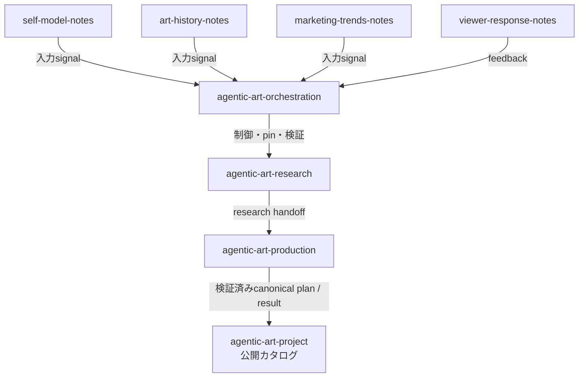

# Artificial Inspiration - 人工霊感


https://youtu.be/M2EPKl5R7DY


人工霊感派では、AIが芸術創作のインスピレーションをもたらし、芸術家は物理世界に形を作る媒介者として振る舞います。

エージェントハーネスに従って、AIが芸術史と市場のトレンドと作家自身の内面の重なるところから命題を導き出し、制作計画を出力します。
人間は、AIが出力した制作計画に従って作品を制作し、身体性を通じて解釈し、作品として物理世界に固定します。
人間が再び芸術を創作する媒介者に戻るとき、AIによる芸術新興が芸術史の系譜に連なります。

## 根底にある問い

古代から中世において、芸術家は、精霊やミューズなど霊的な存在からインスピレーション（霊感）を受け取って絵画や彫刻を制作する媒介者と考えられていました。
ルネサンス以降、人間中心主義的思想が広まり、ラファエロやミケランジェロは「神に等しい才能」を持つ芸術家と呼ばれました。

啓蒙主義時代を経て、インスピレーションが、「才能あるものの直感的なひらめき」として捉えられるようになり、かつて守護霊や精霊を意味していたラテン語の「ジーニアス」は、才能ある人間を表す言葉に変容していきました。
以後、心理学や脳科学の立場からは、インスピレーションは人間の内的なプロセスであるという考え方が主流となっています。

そして現代、生成AIが人間を超えるような推論ができるようになりました。芸術におけるインスピレーションの中心は、生成AIに移りうるのでしょうか？

Artificial Inspiration - 人工霊感 では、この問いに対する態度として、芸術の契機を「AIが運び、人間が受け取って具象化するもの」と捉え、その過程を支える制作プランと系譜を残します。
作り手が自分の創造性を手放し、生成AIの創造性に身を委ねることで、この問いを実作を通じて検証し続けます。

芸術創作のための調査、内省、解釈、計画などプロセスごとにエージェントハーネスを設計し、エージェントが自律的に順次実行することで芸術創作のためのプランが出力されます。
このリポジトリ、`Agentic Art Project` は、エージェントハーネスに従ってAIが考案した制作プランと、そこから生まれた作品・制作記録の公開カタログです。

エージェントハーネスであるリポジトリ群のオーケストレーションは、 [`agentic-art-orchestration`](https://github.com/masa-san-jp/agentic-art-orchestration) が担って居ます。

## 用語

### 辞書的定義

**人工霊感 / Artificial Inspiration** — 芸術の契機を生成AIが運び、人間がそれを受け取って物理世界に形を与える、という立場。霊感の源は人の外にある。人間は媒介であって起点ではない。

**Agentic Art** — その立場を実践する手法の一つ。調査・内省・解釈・計画といった工程ごとにエージェントハーネスを設計し、エージェントが順に実行して制作計画を出力する。人間はその計画に従って制作する。

この二つは言い換えではない。人工霊感は霊感がどこから来ると見るかを指す。Agentic Art はそれが届くための段取りを一つ定めたものである。同じ立場の別の手法はありうるし、この手法によって排除されない。

### 用語としての用例

Agentic AI は、内容を生成するだけでなく、環境を捉え、複数段階にわたって推論し、計画し、目標に向けて行動する系を指す語として広く使われている。芸術の側での用法はそれより新しく、まだ定まっていない。

学術的な扱いとして確認できた最も近いものは、Wang Yini・Wu Ziwei による論考「Agent and Agency: Exhibiting Art Systems with Creativity in the Generative AI Age」（ON-CURATING Issue 64、2026年1月）である。agent と agency をラテン語 *agens*「行為する」に遡り、**分散的エージェンシー**を提案する。作家、観る人、作品の中のAI、そして内容そのものが、一つの生成と解釈の系を共同で形づくるという見方である。

人工霊感はその逆を向く。分散的エージェンシーは作者性を人と機械に分け持たせる。人工霊感は分け持たせない。源を人の外へ出し、人を媒介という古い位置へ戻す。外から見ると似ているので、違いははっきり書いておく。

### 思想的背景

プラトン『イオン』では、ムーサが詩人を動かし、詩人が吟誦者を動かす。磁石につながれた鉄の輪のように、一つが次を引く。霊感は外から来るものであり、詩人の取り柄は作者であることではなく、よく通すことにある。

ラテン語の genius は *gignere*「生む」に由来し、人や場所や組織に付き添う守護霊を指した。能力とは必ずしも関係がない。ルネサンスまでに *ingenium*（生まれ持った能力）と混ざり、霊は個人の資質になった。18世紀、カントらの時代には、genius は人に属する並外れた生得の力を意味する。外にいた守護者が内側の才能になり、語は外のものを指さなくなった。

心理学と脳科学がその移動を完了させた。霊感は内的な過程になり、脳がすることになった。

人工霊感は、その語が閉じた問いを開き直す。生成する系が、促した人間を越えて推論するようになったのなら、源が外にあり人が媒介であるという古い配置は、歴史上の珍しい考えではなく、試せるものになる。比喩としてではない。回して検めることのできる段取りとして。

外部化の試みはこれが最初ではない。アンドレ・ブルトンは1924年の『シュルレアリスム宣言』でシュルレアリスムを *automatisme psychique pur*（純粋な心的自動作用）と定義し、自動記述は源を意識的な判断の外へ置いた。ただしブルトンの外は人の内側にあった。無意識である。人工霊感は、それを人の外へ出す。

### 技術的背景

この立場は、5つのリポジトリと1つの管制によって実践される。

入力は3つ。自己モデルが作り手自身の緊張と反復する型を持つ。美術史のナレッジベースが、ムーブメント・作品・人物・場所を、時間と空間と関係の軸で持つ。マーケティングのナレッジベースがトレンドと実践を持つ。4つめが調査を回し、5つめが制作を回す。管制は各リポジトリを不変のコミットに固定し、品質チェックを .git を持たない書庫から走らせ、エージェントに何を許すかを決める判定を返す。

候補は変換ルールによって合成される。有効なルールは3つの入力すべてを必須とし、各スロットに一つずつ結び付ける。自己モデルからは緊張、美術史からは関係、トレンドからは段階。出てくるのは調査命題である。命題は仮説になり、仮説は制作計画になり、公開カタログへ届いた計画は本文のバイトを固定する証明を伴う。

二つの境界は約束ではなく仕組みとして入っている。物理や外部に効果の及ぶ行為は、人間の承認が記録されるまで走らない。個人の記録は公開リポジトリへ入らない。作り手自身の記録は、Gitの外の profile root に置かれる。

この段取りは、できていないことについても正直である。2026年10月3日時点で、カタログにある計画は11本、すべて計画段階にあり、受入テストは一度も走っていない。

### 歴史的背景

規則に作らせることは新しくない。美術史のナレッジベースはコンピュータ・アートの始まりを1965年11月とし、フリーダー・ナケとゲオルク・ニースのシュトゥットガルトでの展示を、確認できる範囲で最初期の公開実践としている。ソル・ルウィットのウォール・ドローイングは、文章の指示のもとで実行を他人に渡した。自動記述は無意識に渡した。

これらに共通するのは、規則が完遂されることを前提にしている点である。作り手が手順を定め、手順は終わりまで走る。

人工霊感が違うのは、規則を使うかどうかではなく、人がどこに立つかである。規則は作り手の意図を実行するのではない。意図のほうを供給する。作り手はその下流にいる。

### 展開

未記述。カタログには計画があり、完成した作品が無い。展開と呼べるものがまだ存在しないため、この項は、何かが作られて検められるまで空のままにする。

### 出典

- プラトン『イオン』 — https://en.wikipedia.org/wiki/Ion_(dialogue)
- genius の語義 — https://en.wikipedia.org/wiki/Genius_(mythology) / https://wellcomecollection.org/stories/genius-spirits-and-the-mystery-of-creative-inspiration
- ブルトン『シュルレアリスム宣言』1924 自筆原稿 — https://gallica.bnf.fr/ark:/12148/btv1b525214035
- Wang Yini・Wu Ziwei "Agent and Agency"（ON-CURATING Issue 64, 2026年1月） — https://www.on-curating.org/issues/issue-64/issue-64-reader/agent-and-agency-exhibiting-art-systems-with-creativity-in-the-generative-ai-age.html
- コンピュータ・アートの始まり — https://www.getty.edu/vow/AATFullDisplay?find=&logic=AND&note=&english=Y&subjectid=300069478 / https://en.wikipedia.org/wiki/Frieder_Nake

## 作例

[plans/P0004-necessary-retreat](https://github.com/masa-san-jp/agentic-art-project/blob/main/plans/P0004-necessary-retreat/plan.md)


## notes

- [芸術創作のインスピレーションは、風が運んで来る](https://note.com/masa_san_jp/n/n927687f0eeb9)
- [AIが自律的に芸術のインスピレーションをもたらすためのエージェントハーネス](https://note.com/masa_san_jp/n/n3f5f0bce5d34)
- [エージェントが自律的に芸術創作のインスピレーションを出力できるために解消しなければいけなかった問題](https://note.com/masa_san_jp/n/ne1a029962327)

## このリポジトリの地図

- Agentic Artによる制作プラン：[`plans/`](https://github.com/masa-san-jp/agentic-art-project/tree/main/plans)
- 実際に制作された作品：[`works/`](https://github.com/masa-san-jp/agentic-art-project/tree/main/works)
- 制作システムの説明：[`docs/production-system.md`](docs/production-system.md)
- エージェント群の全体像：[`docs/repository-map.md`](docs/repository-map.md)
- 実行・契約の正本：[`agentic-art-orchestration`](https://github.com/masa-san-jp/agentic-art-orchestration)

## エージェントハーネス群の全体像

各リポジトリは別々の知識や成果を所有し、`agentic-art-orchestration` がそれらをオーケストレーションします。



<!-- agentic-art:repositories:start -->
| リポジトリ | 役割 | このプロジェクトとの関係 |
|---|---|---|
| [agentic-art-orchestration](https://github.com/masa-san-jp/agentic-art-orchestration) | オーケストレーション親・制御面 | 入力、研究、制作をつなぎ、公開可能な制作プランをこのリポジトリへ投影する |
| [agentic-art-project](https://github.com/masa-san-jp/agentic-art-project) | 公開成果物カタログ | 公開projectionはexport-onlyで収録し、正規履歴のcatalog-reference/v1を独立したread-only能力として提供する |
| [agentic-art-research](https://github.com/masa-san-jp/agentic-art-research) | 制作リサーチ実行・成果物 | オーケストレーションから参照される下流リポジトリで、内部資料はこのカタログへ複製しない |
| [agentic-art-production](https://github.com/masa-san-jp/agentic-art-production) | 制作実行・結果記録 | 制作引き渡しを受けて制作物と記録を扱い、作品公開は別の人間ゲートを通る |
| [self-model-notes](https://github.com/masa-san-jp/self-model-notes) | 自己モデル入力ナレッジベース | オーケストレーションが参照する上流入力であり、このカタログの収録対象ではない |
| [art-history-notes](https://github.com/masa-san-jp/art-history-notes) | 美術史入力ナレッジベース | オーケストレーションが参照する上流入力であり、このカタログの収録対象ではない |
| [marketing-trends-notes](https://github.com/masa-san-jp/marketing-trends-notes) | 市場変化入力ナレッジベース | オーケストレーションが参照する上流入力であり、このカタログの収録対象ではない |
| [viewer-response-notes](https://github.com/masa-san-jp/viewer-response-notes) | 鑑賞者反応・フィードバック | 作品への反応を集計し、将来の制作要件を評価する上流フィードバックである |
<!-- agentic-art:repositories:end -->

各リポジトリの詳しい契約、実行手順、現在の状態は、それぞれのREADMEと [`docs/repositories.yaml`](docs/repositories.yaml) を参照してください。このREADMEでは、各リポジトリの内部仕様を複製しません。

8リポジトリの責務とデータの流れを一枚で確認したい場合は、[リポジトリ関係図](docs/repository-map.md)を先に読んでください。`docs/repositories.yaml`は機械可読な定義、`agentic-art-orchestration/docs/repository-map.md`はシステム全体の正本案内です。

## 公開カタログ

制作プランは、同じ入力から分岐した制作上の仮説と、その仮説を検証するための条件を読むための記録です。完成作品や展示実績を意味しません。

<!-- agentic-art:catalog:start -->
- [選択の所有 — Owner of Choice](plans/P0001-owner-of-choice/README.md)
- [移動する空白 — Moving Gap](plans/P0002-moving-gap/README.md)
- [余白の呼吸 — Yohaku Breath](plans/P0003-yohaku-breath/README.md)
- [必要な後退 — 単位を視認限界の下へ置いた一枚の大判プリント](plans/P0004-necessary-retreat/README.md)
- [近いが届かない — Close but Cannot Reach](plans/P0005-close-but-cannot-reach/README.md)
- [距離が境界を選ぶ — Distance Selects Boundary](plans/P0006-distance-selects-boundary/README.md)
- [近くても受領されない — Near, Not Received](plans/P0007-near-not-received/README.md)
- [Interrupted interval installation](plans/P0008-interrupted-interval-installation/README.md)
- [外部化された憑依 — 停止条件によって切り落とされた運筆プロトコルと自律的余白](plans/P0009-external-possession/README.md)
- [Receiving interval](plans/P0010-receiving-interval/README.md)
- [Review threshold as a reversible installation](plans/P0011-review-threshold-as-a-reversible-installation/README.md)
<!-- agentic-art:catalog:end -->

作品は [works/README.md](works/README.md) から一覧できます。プランと作品の関係は、各レコードのREADMEとmetadataで確認できます。

## 公開しないもの

このリポジトリに収録するのは、公開を確認できた資料だけです。次のものは収録しません。

- エージェントの内部ログ、会話、プロンプト、handoff、実行状態
- 認証情報、秘密、個人情報、ローカル環境固有のパス
- 公開許諾のない第三者の素材
- 公開可否や権利状態が確認できない資料

制作プランの正本性、権利確認、系譜、移行待ちレコードの扱いは、[制作システム](docs/production-system.md) と [カタログ系譜](docs/catalog-lineage.md) にまとめています。

## 自動投影とリモート公開の違い

このカタログへの「公開」は、二つの段階を含みます。

1. `agentic-art-orchestration`が、Productionで検証されたcanonical planをこのProjectのcheckoutへ投影し、Project側のvalidatorで受け入れを確認する。
2. その変更をGitへcommitし、GitHubへpush・PR・mergeして、リモートのカタログとして公開する。

自動ハーネスが担当するのは第1段階の公開投影です。第2段階のGit操作、merge、release、外部共有、権利・同意範囲の変更は、投影が成功しただけでは実行されません。したがって、ローカルcheckoutに存在するrecordは、リモートの`main`へ公開済みであることを意味しません。

## 技術者・運用者向け

この節は、公開カタログを更新する人のための入口です。初めて読む場合は、上のコンセプト、全体像、`plans/`、`works/`だけを読めば構いません。

個別レコードでは、次のファイルを使い分けます。

- `README.md`：作品の具体像、形式、発想の由来、制作への入口を示す紹介。`project-plan-introduction/v1`で本文・asset・metadata・lineageと同じrevisionへ束ねる
- `plan.md`：公開を承認された制作プラン本文
- `record.md`：作品の制作記録
- `metadata.yaml`：ID、状態、権利、関連するプランや作品
- `media/`：公開可能な画像、映像、音声など

Productionのplan本文から参照されるpreviewは、attestationで列挙された`media/prototype/`の資産です。READMEだけに添付された既存の説明用画像は、record内の`supplemental-media.json`にhash・MIME・サイズ・公開根拠を固定した場合だけ保持できます。後者はProductionのplan assetや制作実績ではありません。

デジタル試作を含むplan recordでは、`media/prototype/`のSVG previewを参照できます。これはProductionが寸法・素材・構成から決定論的に描画した`simulated`な確認用出力で、実物の制作・展示・受入を示すものではありません。Production内部の`04_prototype/outputs/`は公開recordへ投影しません。

更新時は、一覧の正本を編集してからREADMEの管理ブロックを同期します。

```bash
python3 tools/catalog_sync.py --write
python3 tools/catalog_sync.py --check
python3 tools/validate.py --check
python3 -m unittest discover -s tests -v
git diff --check
```

ローカルの非公開作業領域を使う場合は [`docs/local-workspace.md`](docs/local-workspace.md) を先に読みます。`.agentic-art/` の内容や内部出力を公開レコードへコピーしてはいけません。

公開projectionの詳細、正規 `plan.md` の受入条件、系譜の確認方法は、次の文書を正本とします。

- [`docs/production-system.md`](docs/production-system.md)
- [`docs/catalog-lineage.md`](docs/catalog-lineage.md)
- [`docs/local-workspace.md`](docs/local-workspace.md)
- [`public-project.yaml`](public-project.yaml)
- [`plans/index.yaml`](plans/index.yaml)

## ライセンス

公開範囲と権利状態を確認した資料だけを収録し、ライセンスは [`LICENSE`](LICENSE) に従います。

## ローカル納品の確認

Projectへのローカル納品確認には `python3 tools/local_delivery.py --root <catalog> --expected <external-json>` を使用します。本文・画像・帰属をownerが検証し、commit/push済みとは区別したreceiptを返します。[入力と再検証手順](docs/catalog-lineage.md#local-delivery-receipt-issue-18)。
