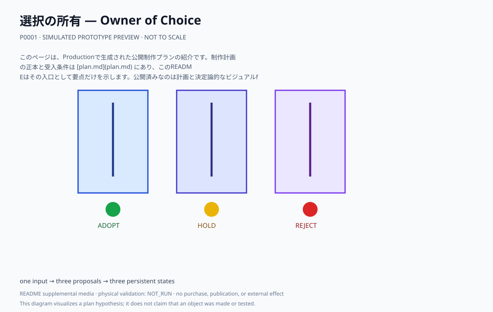

# 選択の所有 — Owner of Choice

一つの抽象入力を三つの翻訳案へ分岐し、観客が採用・保留・拒否のいずれかを選ぶ三面の翻訳室。保留と拒否も消去せず状態として残す。

## このプランで見るもの

三枚の半透明パネルを回り、同じ入力から分岐した三案と、それぞれの選択状態を見比べる。

**主張:** 翻訳案を提示する者と、最後に選択する者は同じではない。拒否と保留も選択として残る。

**固有の構成:** 三面パネル、三つの手動スイッチ、持続する状態表示。個人の原資料は保持しない。

<!-- prototype-visualization:start -->
## 試作の可視化

このSVGは、公開済みの制作プラン本文から構成を読み取り、Project側で決定的に描画した `simulated` な確認用出力です。実物の試作、物理検証、鑑賞者検証、制作実績、公開承認を示しません。canonicalな `plan.md` とProduction attestationには追記せず、README専用の補助メディアとして保持しています。
<!-- prototype-visualization:end -->

## 制作状態

このページは、Productionで生成された公開制作プランの紹介です。制作計画の正本と受入条件は [plan.md](plan.md) にあり、このREADMEはその入口として要点だけを示します。公開済みなのは計画と決定論的なビジュアルfixtureであり、物理制作・購入・契約・展示・外部連絡を実行した記録ではありません。実行前に、plan.md の未解決事項と承認境界を確認してください。

## 関連ファイル

- [完全な制作プラン](plan.md)
- [コンセプト・モックアップ](media/concept-mockup.svg)
- [ビジュアルリファレンスボード](media/visual-reference-board.svg)
- [公開プラン証明](public-plan-attestation.json)
- [生成メタデータ](metadata.yaml)
- [来歴](lineage.json)
