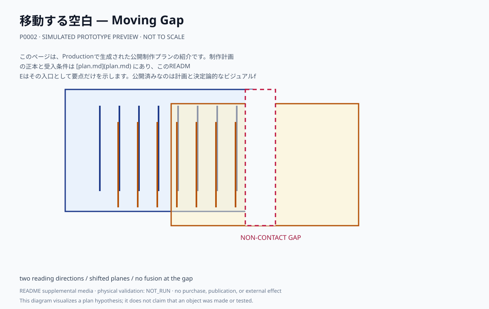
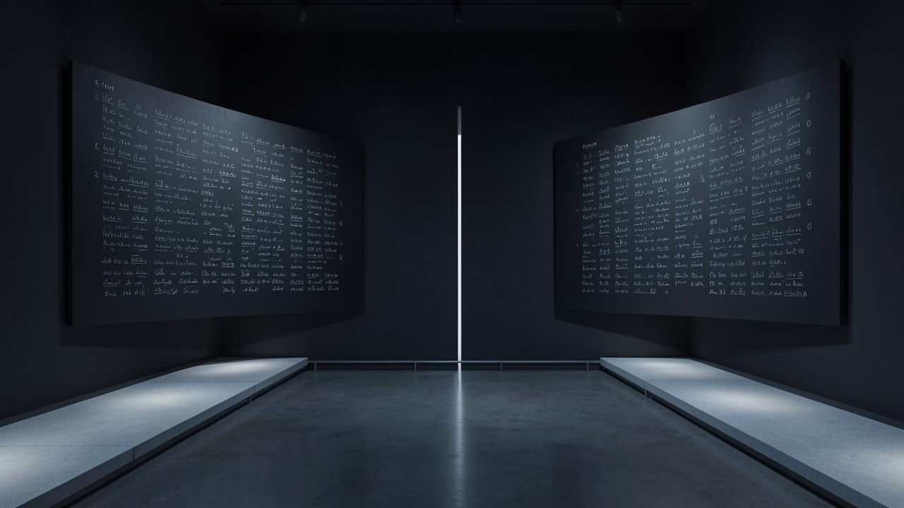

# 移動する空白 — Moving Gap

異なる記号系を載せた二層の面をずらして重ね、二方向からの接近で異なる読解を生む。中央の隙間は接触や融合を許さない。

## このプランで見るもの

二つの進入方向を移動し、片側ずつ読みやすくなる記号と中央の局所的な隙間を比較する。

**主張:** 近づくと知識は増えるが、近づいた者が相手の形式を動かせるとは限らない。

**固有の構成:** 二層の平面、二方向の接近経路、非接触の停止点。異なる伝統を一つに均質化しない。

<!-- prototype-visualization:start -->
## 試作の可視化

このSVGは、公開済みの制作プラン本文から構成を読み取り、Project側で決定的に描画した `simulated` な確認用出力です。実物の試作、物理検証、鑑賞者検証、制作実績、公開承認を示しません。canonicalな `plan.md` とProduction attestationには追記せず、README専用の補助メディアとして保持しています。

二層の面を意図的にずらして重ね、それぞれに別の記号系を載せています。中央に立つ細い光の筋が、接触も融合も許さない局所的な隙間です。左右の低い通路が二方向の接近経路にあたり、どちらから入るかで読める側が変わります。

ローカル生成によるレンダリングであり、制作した現物の写真ではありません。物理試作、外部検証、展示の実施記録を示しません。
<!-- prototype-visualization:end -->

## 制作状態

このページは、Productionで生成された公開制作プランの紹介です。制作計画の正本と受入条件は [plan.md](plan.md) にあり、このREADMEはその入口として要点だけを示します。公開済みなのは計画と決定論的なビジュアルfixtureであり、物理制作・購入・契約・展示・外部連絡を実行した記録ではありません。実行前に、plan.md の未解決事項と承認境界を確認してください。

## 関連ファイル

- [完全な制作プラン](plan.md)
- [コンセプト・モックアップ](media/concept-mockup.svg)
- [ビジュアルリファレンスボード](media/visual-reference-board.svg)
- [公開プラン証明](public-plan-attestation.json)
- [生成メタデータ](metadata.yaml)
- [来歴](lineage.json)
