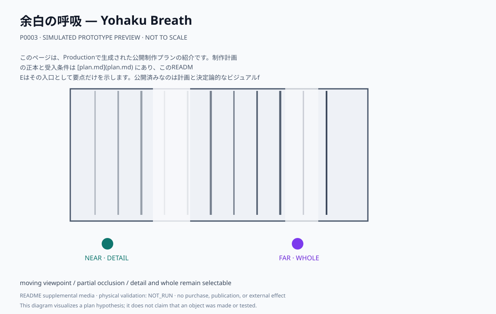
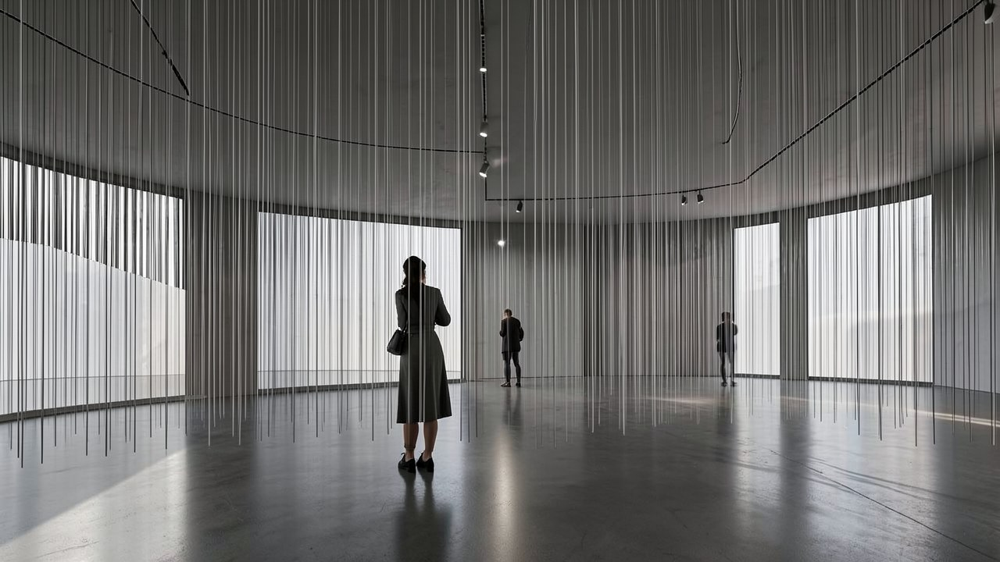

# 余白の呼吸 — Yohaku Breath

視線の高さを越える線群と部分的な遮蔽によって、近距離では細部、遠距離では全体の構図が優先される場をつくる。

## このプランで見るもの

観客は前後左右へ自由に動き、細部と全体のどちらを取るかを何度でも選び直す。

**主張:** 近づけば細部が、離れれば全体が見える。どちらを選ぶかに唯一の正解はない。

**固有の構成:** 線群、遮蔽、視点の移動。鑑賞者の選択を一つの正解へ固定しない。

<!-- prototype-visualization:start -->
## 試作の可視化

このSVGは、公開済みの制作プラン本文から構成を読み取り、Project側で決定的に描画した `simulated` な確認用出力です。実物の試作、物理検証、鑑賞者検証、制作実績、公開承認を示しません。canonicalな `plan.md` とProduction attestationには追記せず、README専用の補助メディアとして保持しています。

視線の高さを越える線群が室内を横断し、部分的な遮蔽が視線を切ります。近くに立つ人は細部を、奥に離れた人は全体の構図を取っています。どちらを選ぶかに正解を置かない、という plan.md の主張がそのまま配置になっています。

ローカル生成によるレンダリングであり、制作した現物の写真ではありません。物理試作、外部検証、展示の実施記録を示しません。
<!-- prototype-visualization:end -->

## 制作状態

このページは、Productionで生成された公開制作プランの紹介です。制作計画の正本と受入条件は [plan.md](plan.md) にあり、このREADMEはその入口として要点だけを示します。公開済みなのは計画と決定論的なビジュアルfixtureであり、物理制作・購入・契約・展示・外部連絡を実行した記録ではありません。実行前に、plan.md の未解決事項と承認境界を確認してください。

## 関連ファイル

- [完全な制作プラン](plan.md)
- [コンセプト・モックアップ](media/concept-mockup.svg)
- [ビジュアルリファレンスボード](media/visual-reference-board.svg)
- [公開プラン証明](public-plan-attestation.json)
- [生成メタデータ](metadata.yaml)
- [来歴](lineage.json)
