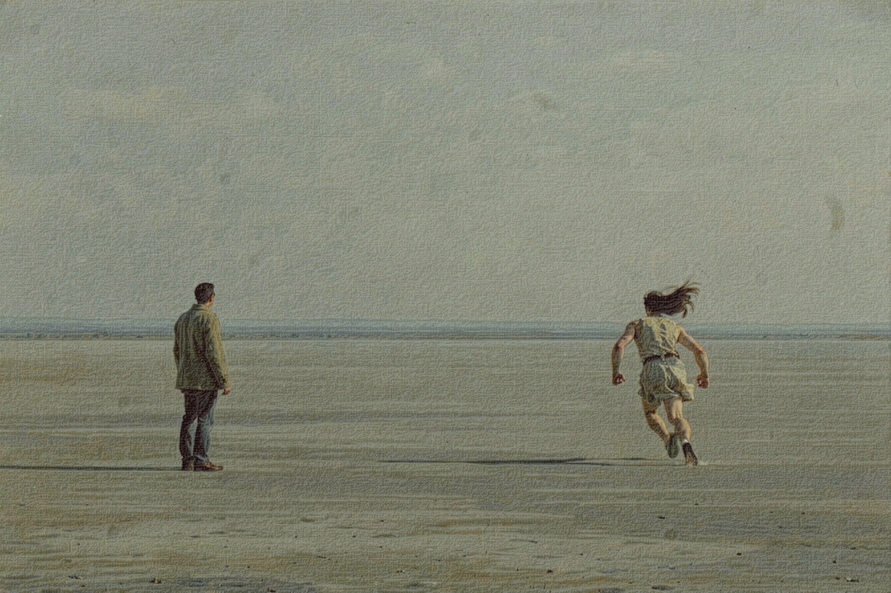
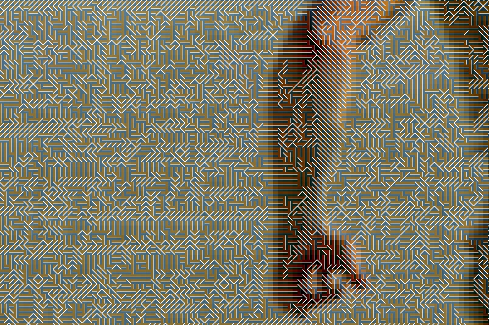

# 必要な後退 — 単位を視認限界の下へ置いた一枚の大判プリント

遠くで像が立ち、近づくと像が失われる構造を、単位の物理寸法によって成立させる大判プリントの制作計画です。

遠景の見本です。実寸 1527.9 × 1018.2 mm の印刷原版を 1625 px 幅へ縮小しています。計画の完成像は、壁面から4メートル前後で像が立つことを条件にしています。

同じ画面の原寸部分です。300 dpi のまま切り出しており、1辺 1.1853 mm の単位が約 118 × 79 個入ります。この距離では像が読めません。近づくと像が失われる構造は、単位の物理寸法だけで成立しています。

いずれも印刷原版からのレンダリングであり、印刷した現物の写真ではありません。

- [完全な制作プラン本文](plan.md)
- [ビジュアルリファレンスボード](media/visual-reference-board.svg)
- [コンセプト・モックアップ](media/concept-mockup.svg)
- [Production公開証明](public-plan-attestation.json)
- [来歴メタデータ](metadata.yaml)

本文は agentic-art-production が生成した 03_plan/production-plan.md と同一バイトです。要約・翻訳・節の削除は行っていません。計画には完成像、テーマ、コンセプト、根拠、仕様、工程、受入条件、日程、予算、リスク、承認境界、未解決事項が含まれます。

計画の公開は、購入・契約・物理制作・外部連絡・完成作品の公開を承認するものではありません。実行前に本文の承認境界と未解決事項を確認してください。
