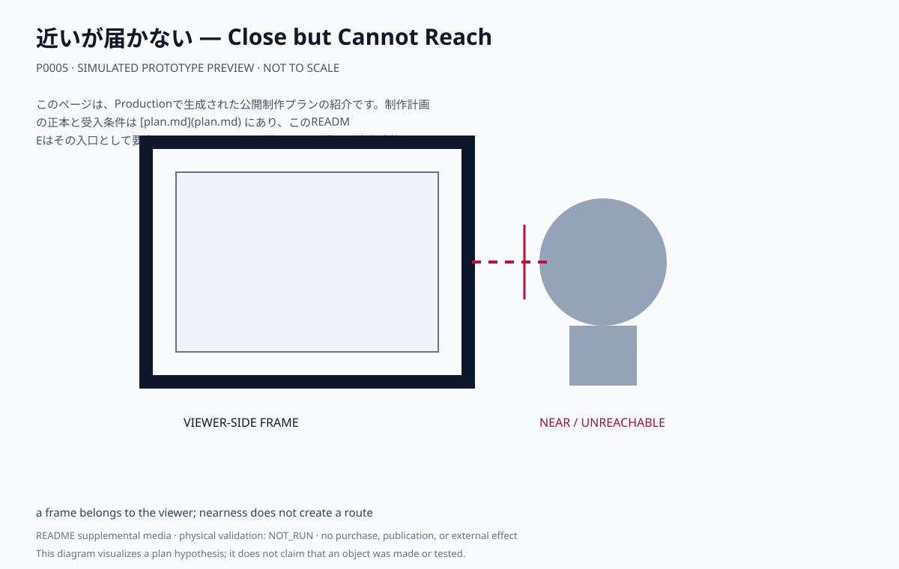
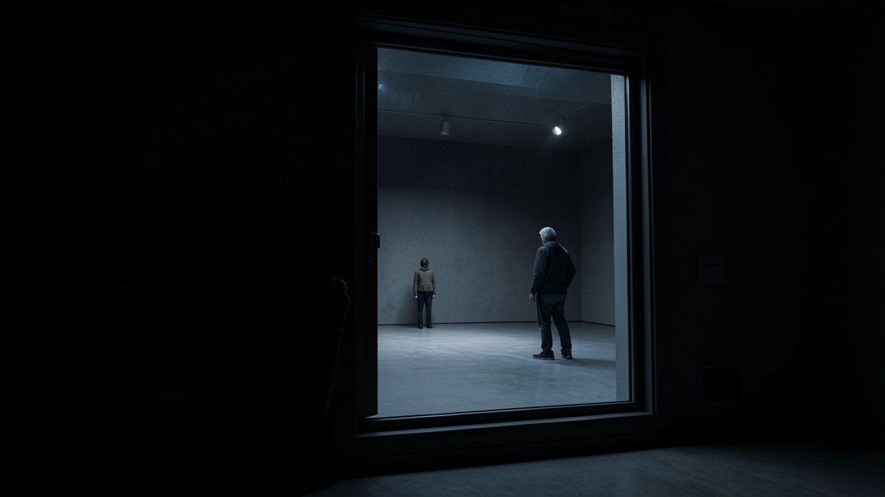

# 近いが届かない — Close but Cannot Reach

匿名の人影または抽象像の手前に、観客側に属する枠を置く。近さをつくっても、相手へ到達する道具や目標は置かない。

## このプランで見るもの

観客は自分の側の枠越しに像を見るが、像へ向かう梯子・階段・ロープ・到達目標は見つけられない。

**主張:** 届かないのは距離だけの問題ではなく、誰が枠を持ち、誰を見ているかの問題である。

**固有の構成:** 観客側の枠、匿名の像、非対称な視線。距離を解決する装置を追加しない。

<!-- prototype-visualization:start -->
## 試作の可視化

このSVGは、公開済みの制作プラン本文から構成を読み取り、Project側で決定的に描画した `simulated` な確認用出力です。実物の試作、物理検証、鑑賞者検証、制作実績、公開承認を示しません。canonicalな `plan.md` とProduction attestationには追記せず、README専用の補助メディアとして保持しています。

手前の重い枠は観客の側に属します。枠の向こうに匿名の像が立ちますが、梯子も階段もロープも架けていません。近づくほど枠の縁と自分の位置が視界を占め、距離が縮まっても到達の手段は増えません。

ローカル生成によるレンダリングであり、制作した現物の写真ではありません。物理試作、外部検証、展示の実施記録を示しません。
<!-- prototype-visualization:end -->

## 制作状態

このページは、Productionで生成された公開制作プランの紹介です。制作計画の正本と受入条件は [plan.md](plan.md) にあり、このREADMEはその入口として要点だけを示します。公開済みなのは計画と決定論的なビジュアルfixtureであり、物理制作・購入・契約・展示・外部連絡を実行した記録ではありません。実行前に、plan.md の未解決事項と承認境界を確認してください。

## 関連ファイル

- [完全な制作プラン](plan.md)
- [コンセプト・モックアップ](media/concept-mockup.svg)
- [ビジュアルリファレンスボード](media/visual-reference-board.svg)
- [公開プラン証明](public-plan-attestation.json)
- [生成メタデータ](metadata.yaml)
- [来歴](lineage.json)
