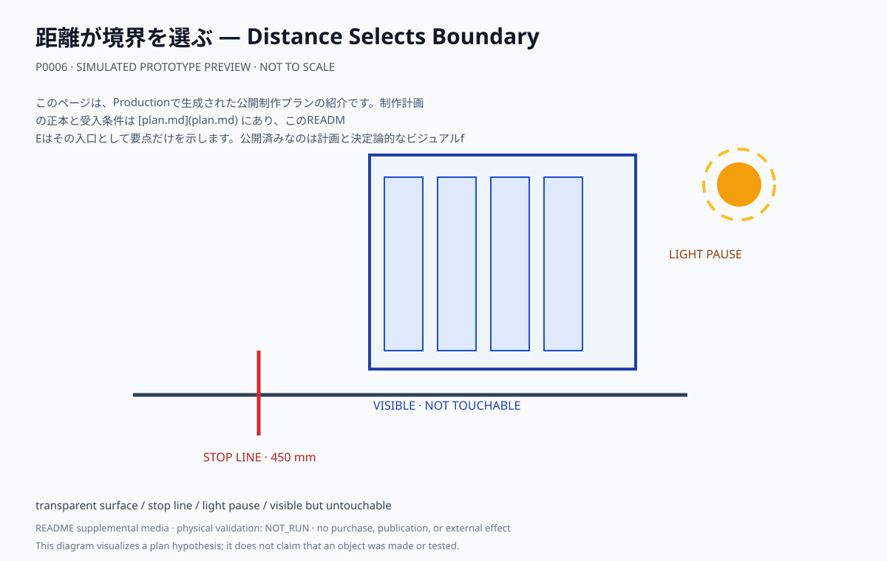
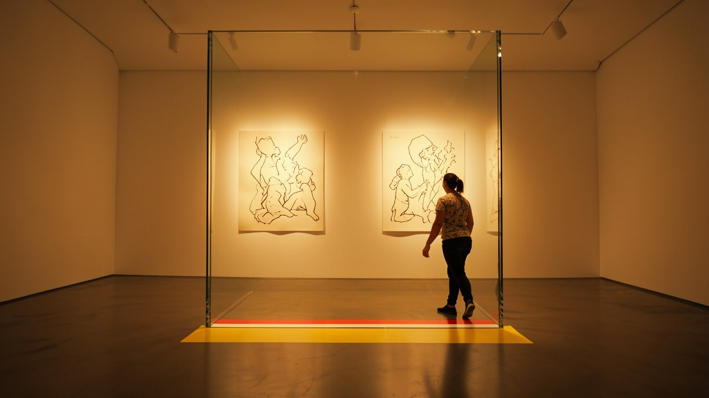

# 距離が境界を選ぶ — Distance Selects Boundary

1800×2100mmの透明ポリカーボネート面の向こうに歪んだ線画を置き、停止線と光の休止によって「見えるが触れない」距離を構成する。

## このプランで見るもの

手前450mmの停止線と幅1200mmの通路を保ちながら、30秒周期の暖色光（静止区間10秒以上）を受ける。

**主張:** 近づくほど見えるが、手は届かない距離が注意をつくる。休止は効果ではなく構成である。

**固有の構成:** 透明面、4枚以上の線画、停止線、通路幅、光周期。センサーと接触は使わない。

<!-- prototype-visualization:start -->
## 試作の可視化

このSVGは、公開済みの制作プラン本文から構成を読み取り、Project側で決定的に描画した `simulated` な確認用出力です。実物の試作、物理検証、鑑賞者検証、制作実績、公開承認を示しません。canonicalな `plan.md` とProduction attestationには追記せず、README専用の補助メディアとして保持しています。

床から頭上まで立つ透明面の向こうに歪んだ線画を吊っています。手前の床に引いた停止線が、見えるが触れない距離を決めます。暖色光は周期のなかで静止しており、休止は効果ではなく構成の一部です。

ローカル生成によるレンダリングであり、制作した現物の写真ではありません。物理試作、外部検証、展示の実施記録を示しません。
<!-- prototype-visualization:end -->

## 制作状態

このページは、Productionで生成された公開制作プランの紹介です。制作計画の正本と受入条件は [plan.md](plan.md) にあり、このREADMEはその入口として要点だけを示します。公開済みなのは計画と決定論的なビジュアルfixtureであり、物理制作・購入・契約・展示・外部連絡を実行した記録ではありません。実行前に、plan.md の未解決事項と承認境界を確認してください。

## 関連ファイル

- [完全な制作プラン](plan.md)
- [コンセプト・モックアップ](media/concept-mockup.svg)
- [ビジュアルリファレンスボード](media/visual-reference-board.svg)
- [公開プラン証明](public-plan-attestation.json)
- [生成メタデータ](metadata.yaml)
- [来歴](lineage.json)
