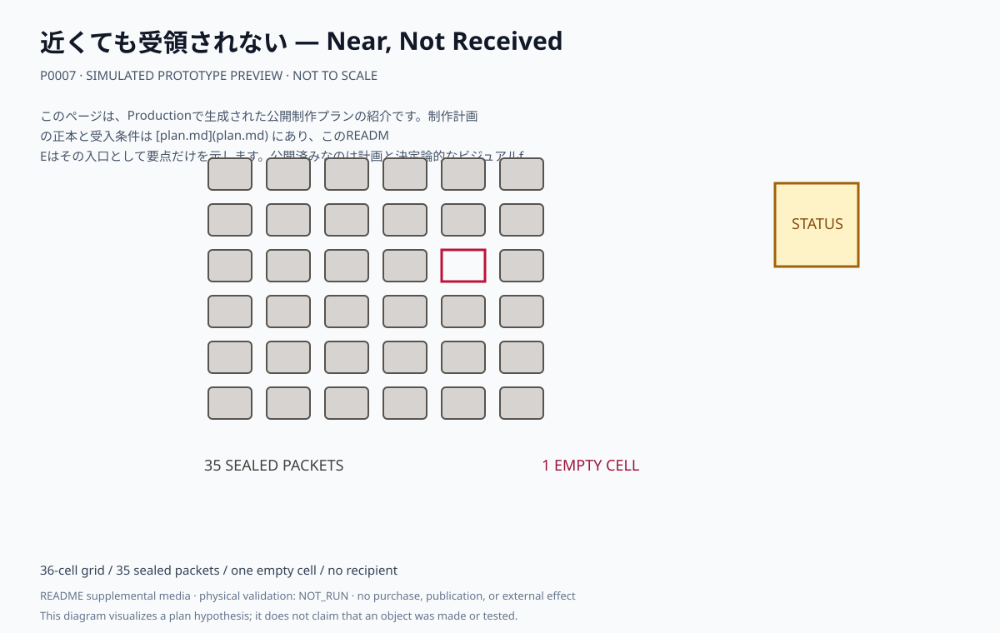
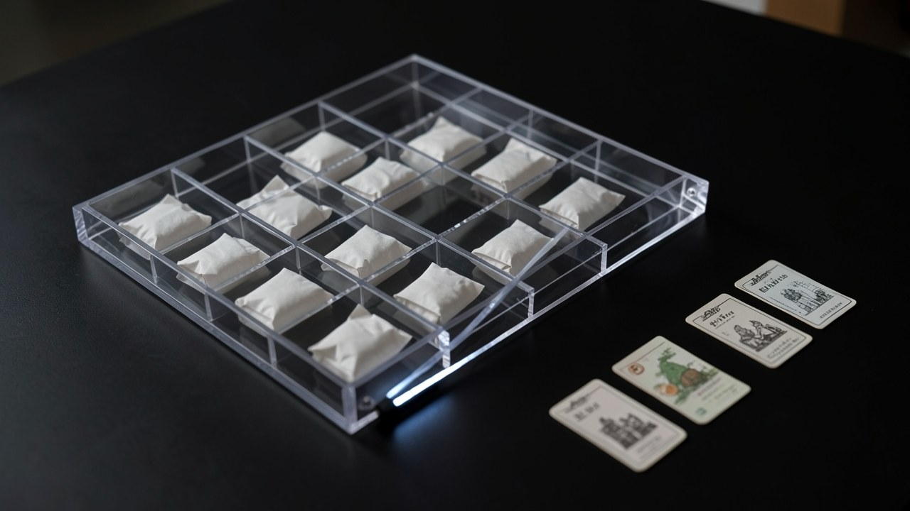

# 近くても受領されない — Near, Not Received

A3の浅い透明な閉箱を36セルに分け、35個の同型紙包みと一つの空セルを置く。近い包みも箱を開けなければ触れられない。

## このプランで見るもの

卓上の外周から全36セルと状態カードを見比べ、近いのに受領されない包みと空セルを確認する。

**主張:** 近くにいることは、届いたことでも介入できたことでもない。受領されない状態も完成している。

**固有の構成:** 6×6セル、35個の紙包み、一つの空セル、状態カード、電池式LED、固定影板。実在の配送先や受取人は持たない。

<!-- prototype-visualization:start -->
## 試作の可視化

このSVGは、公開済みの制作プラン本文から構成を読み取り、Project側で決定的に描画した `simulated` な確認用出力です。実物の試作、物理検証、鑑賞者検証、制作実績、公開承認を示しません。canonicalな `plan.md` とProduction attestationには追記せず、README専用の補助メディアとして保持しています。

浅い透明の閉箱を格子に区切り、同型の紙包みを一つずつ入れ、一つのセルだけ空けています。包みは手の届く場所にありますが、箱を開けなければ触れられません。傍らの状態カードが、受領されない状態も完成した状態であることを示します。

ローカル生成によるレンダリングであり、制作した現物の写真ではありません。物理試作、外部検証、展示の実施記録を示しません。
<!-- prototype-visualization:end -->

## 制作状態

このページは、Productionで生成された公開制作プランの紹介です。制作計画の正本と受入条件は [plan.md](plan.md) にあり、このREADMEはその入口として要点だけを示します。公開済みなのは計画と決定論的なビジュアルfixtureであり、物理制作・購入・契約・展示・外部連絡を実行した記録ではありません。実行前に、plan.md の未解決事項と承認境界を確認してください。

## 関連ファイル

- [完全な制作プラン](plan.md)
- [コンセプト・モックアップ](media/concept-mockup.svg)
- [ビジュアルリファレンスボード](media/visual-reference-board.svg)
- [公開プラン証明](public-plan-attestation.json)
- [生成メタデータ](metadata.yaml)
- [来歴](lineage.json)
