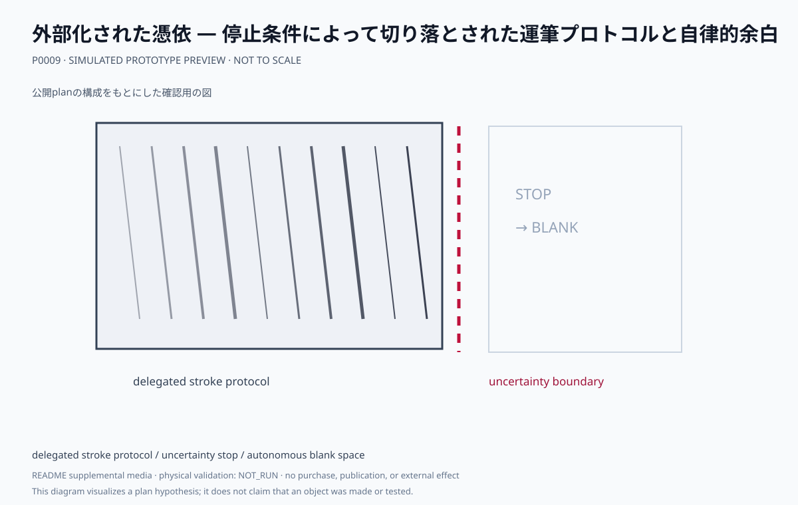

# 外部化された憑依 — 停止条件によって切り落とされた運筆プロトコルと自律的余白

エージェントが生成する運筆プロトコルを作家が代筆し、不確実性停止によって創出された余白を持つ大判作品の制作計画です。

- [完全な制作プラン本文](plan.md)
- [ビジュアルリファレンスボード](media/visual-reference-board.svg)
- [コンセプト・モックアップ](media/concept-mockup.svg)
- [Production公開証明](public-plan-attestation.json)
- [来歴メタデータ](metadata.yaml)

本文は agentic-art-production が生成した 03_plan/production-plan.md と同一バイトです。要約・翻訳・節の削除は行っていません。計画には完成像、テーマ、コンセプト、根拠、仕様、工程、受入条件、日程、予算、リスク、承認境界、未解決事項が含まれます。

計画の公開は、購入・契約・物理制作・外部連絡・完成作品の公開を承認するものではありません。実行前に本文の承認境界と未解決事項を確認してください。

<!-- prototype-visualization:start -->
## 試作の可視化

このSVGは、公開済みの制作プラン本文から構成を読み取り、Project側で決定的に描画した `simulated` な確認用出力です。実物の試作、物理検証、鑑賞者検証、制作実績、公開承認を示しません。canonicalな `plan.md` とProduction attestationには追記せず、README専用の補助メディアとして保持しています。
<!-- prototype-visualization:end -->
