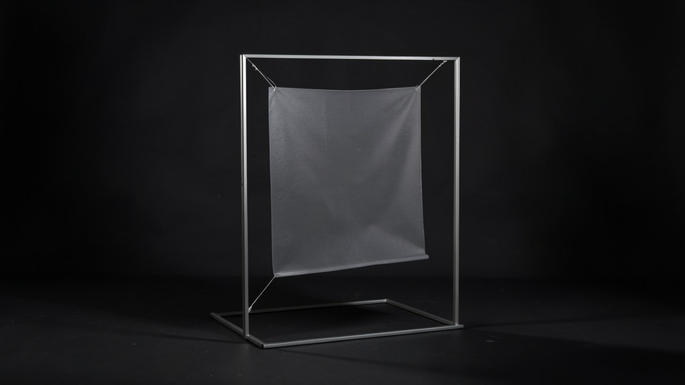

# Receiving interval

## 作品体験

入ってきた人は、説明のない半透明面と細い光の関係を目で追う。, 小さな変化を待ち、閾値の前後で同じ関係を見直す。, 変化の原因を説明されずに、受け取った間隔を自分の経験として残す。

## 主張

間隔は、見直すきっかけが生じたときに初めて、見えていたものとして知覚される。

## 発想の由来

空気の到来を、半透明面と光の静かな受け取りとして経験すること 制作機構は 半透明面を細い光の中に吊り、小さな空気の変化が面の縁または影を一度だけずらす。鑑賞者は到着、待機、戻りを通して同じ関係を再読する。

## 素材・形式

形式: Production の正本 plan に定義された形式。正本の本文と、受入済み attestation が列挙する asset を参照します。

- [concept-mockup.svg](media/concept-mockup.svg)
- [visual-reference-board.svg](media/visual-reference-board.svg)

<!-- prototype-visualization:start -->
## 試作の可視化

細い光の中に半透明面を吊った状態です。面の下端と、床に落ちた影の位置がわずかにずれています。小さな空気の到来が、面の縁または影を一度だけ動かす機構に当たります。到着・待機・戻りの三状態のうち、閾値を越えた後の一枚として読めます。

ローカル生成によるレンダリングであり、制作した現物の写真ではありません。物理試作、外部検証、展示の実施記録を示しません。
<!-- prototype-visualization:end -->

## 制作入口

制作判断と受入条件の入口は [plan.md](plan.md) です。ここで公開されるのは検証済みの制作計画と紹介であり、物理制作、購入、契約、展示、外部連絡はこの投影から実行されません。
